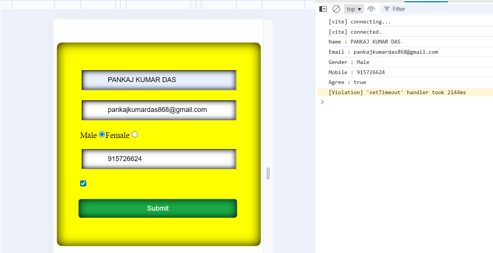
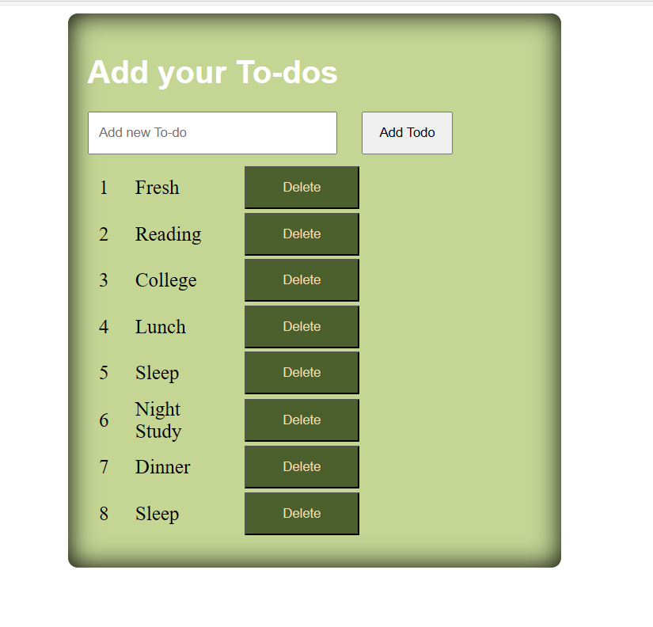

# Entry-Level-react-projects
A collection of beginner-friendly React projects designed to strengthen core concepts like components, props, state management, hooks, event handling, and API integration. Each mini-project is simple, practical, and focused on helping new developers build confidence while learning real-world front-end fundamentals.
<table>
  <thead>
    <th>Preview</th>
    <th>Title</th>
    <th>Action </th>
    <th>Give Star </th>
  </thead>

<tbody>
  <tr>
    <td width="25%"> </td>
    <td width="35%">Simple Contact Form using React useState variable</td>
    <td width="20%">  <a href="https://github.com/Pankajdas0025/Entry-Level-react-projects/fork">Fork on GitHub</a> </td>
    <td width="20%">   <a href="https://github.com/Pankajdas0025/Entry-Level-react-projects/stargazers">⭐ Star</a>  </td>
  </tr>
  <tr>
    <td width="25%"> </td>
    <td width="35%">To-dos app to follow daily activity</td>
    <td width="20%">  <a href="https://github.com/Pankajdas0025/Entry-Level-react-projects/fork">Fork on GitHub</a> </td>
    <td width="20%">   <a href="https://github.com/Pankajdas0025/Entry-Level-react-projects/stargazers">⭐ Star</a>  </td>
  </tr>
  <tr>
    <td width="25%"> </td>
    <td width="35%">Expense tracker App </td>
    <td width="20%">  <a href="https://github.com/Pankajdas0025/Entry-Level-react-projects/fork">Fork on GitHub</a> </td>
    <td width="20%">   <a href="https://github.com/Pankajdas0025/Entry-Level-react-projects/stargazers">⭐ Star</a>  </td>
  </tr>
</tbody>

  </table>
